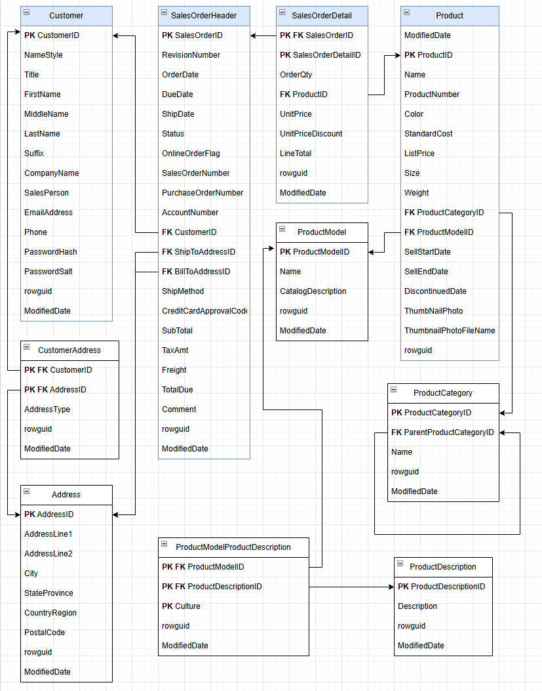
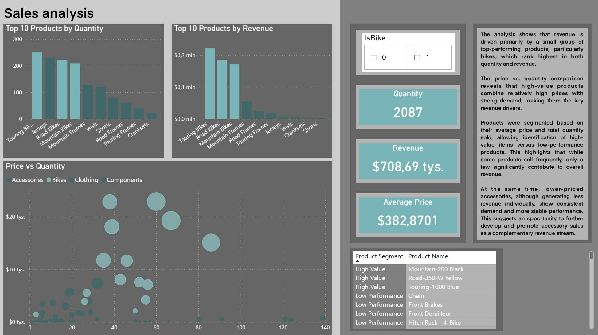
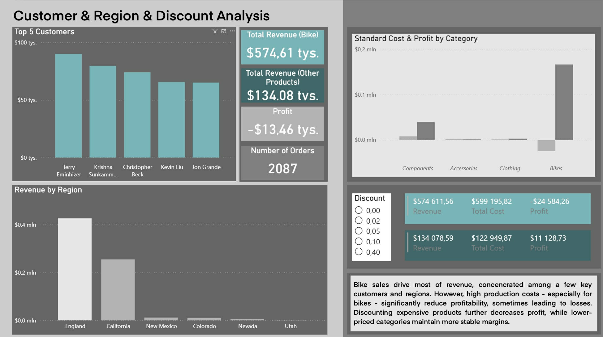

# Bike Sales Analysis (SQL + Power BI)

## Business Problem

The goal of this project is to analyze bike product sales and identify key revenue drivers.

The analysis focuses on understanding:
- what drives revenue
- which products and customers are most valuable
- how sales vary across regions
- whether discounts impact performance

## Dataset

The project uses the AdventureWorksLT sample database, which represents a simplified e-commerce system.

Key tables:
- SalesOrderHeader (orders)
- SalesOrderDetail (order items)
- Product (product information)
- Customer (customer data)
- Address (location data)

## Data Model

The dataset follows a relational structure:

Customer → SalesOrderHeader → SalesOrderDetail → Product

Products are organized into hierarchical categories.  
Bike products were identified using the product category hierarchy.

### Entity Relationship Diagram

## Data Preparation

A dedicated analytical dataset was created using a SQL VIEW.

Instead of filtering only bike products, a flag column (IsBike) was introduced 
to allow both focused and comparative analysis.

This approach enables analysis of bike sales in the context of overall store performance.

## Analysis

The analysis was structured into five areas:

### A. Revenue
- Total bike revenue
- Average revenue per order

### B. Products
- Top products by revenue
- Top products by quantity
- Revenue drivers (price vs quantity)

### C. Customers
- Top customers
- Revenue concentration

### D. Location
- Revenue by region

### E. Promotions
- Discount usage
- Impact of discounts on revenue

## Key Insights

- Bike revenue is primarily driven by high-value products rather than volume
- A small number of products generate the majority of revenue
- Revenue is highly concentrated among a small group of customers
- Sales are concentrated in specific regions
- Discounts are not the main driver of revenue

## Business Recommendations

- Focus on retaining high-value customers
- Promote top-performing bike products
- Avoid excessive discounting
- Explore growth opportunities in underperforming regions

## Dashboard Overview

This dashboard presents overall store performance, including total revenue, average order value, and number of orders, with a breakdown of bike vs. non-bike customers and top products by category.

## Dashboard Sales analysis

This dashboard analyzes product performance by showing top products by revenue and quantity, along with a price vs. quantity comparison to identify key revenue drivers and product segments.

## Dashboard Customer, Region & Discount Analysis 

This dashboard highlights top customers, revenue distribution across regions, and the impact of discounts on revenue and profitability.

## Tools

- SQL (Azure SQL)
- Power BI
- GitHub
